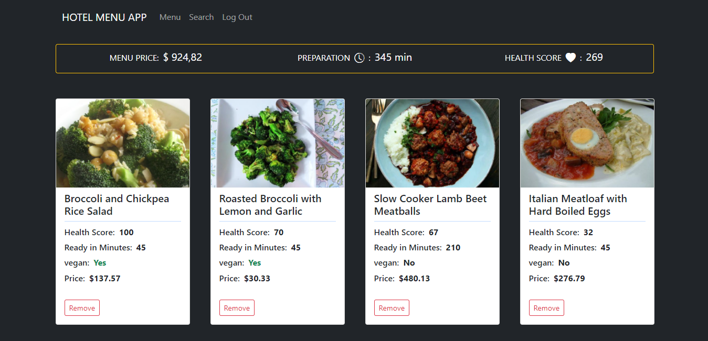

# Alkemy Frontend Challenge

### The project was about building a menu app for a hotel using React.js

You have the menu tab, where you see 4 menu plates, where two have to be vegan. On the top is the menu information, with the total price of the menu, the average preparation time and the average health score.
Then you have the search tab, where you can search for a plate to add it to the menu.
The detail tab, where you can see the plate details.
You cannot enter any routee unless you are logged.

The app uses the spoonacular API (https://spoonacular.com/)

